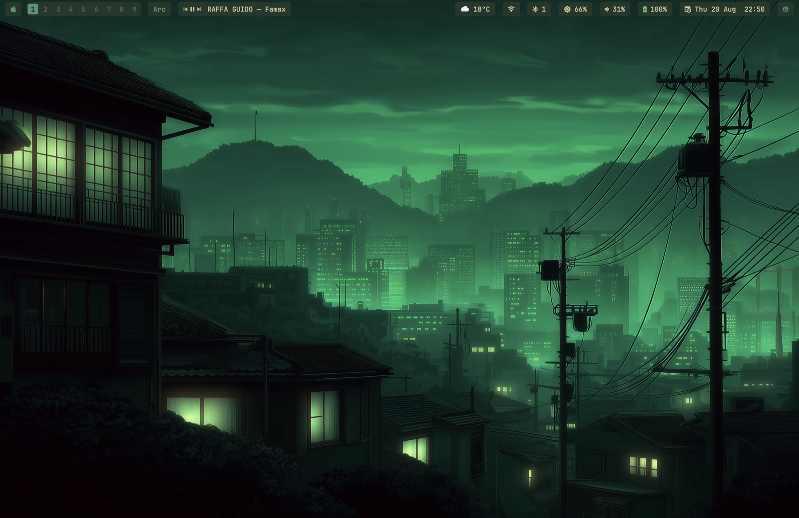
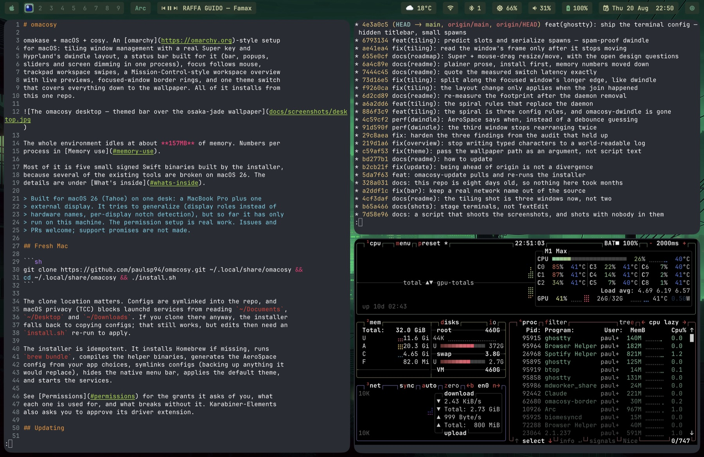
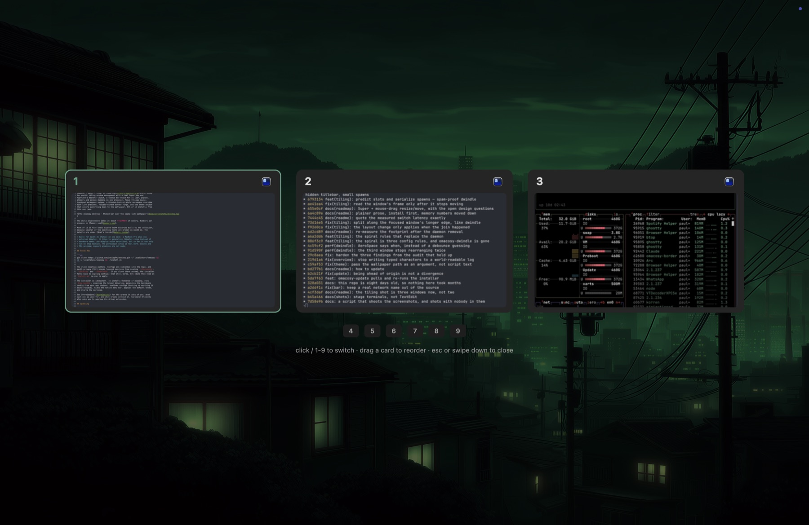

# omacosy

omakase + macOS + cosy. An [omarchy](https://omarchy.org)-style setup
for macOS: tiling window management with a real Super key and
Hyprland's dwindle layout, a status bar built for it (bar, popups,
sliders and screen dimming in one process), focus follows mouse,
trackpad workspace swipes, a Mission-Control-style workspace overview
with live previews, focused-window border rings, and one theme switch
that covers everything down to the wallpaper. All of it installs from
this one repo.



The whole environment idles at about **133MB** of memory. Numbers per
process in [Memory use](#memory-use).

Most of it is five small signed Swift binaries built by the installer,
because several of the existing tools are broken on macOS 26. The
details are under [What's inside](#whats-inside).

> Validated on macOS 27.0 beta on one desk: a MacBook Pro plus one
> external display. The low-level compatibility work originated on
> macOS 26 (Tahoe). It tries to generalize (display roles instead of
> hardware names, per-display notch detection), but so far it has only
> run on this machine. The permission setup is real work. Issues and
> PRs welcome; support promises are not made.

This fork's user-facing changes from upstream are:

- Installation and runtime validation on macOS 27.0 beta, while
  retaining the low-level Tahoe compatibility workarounds.
- Command is Super directly. Karabiner, its root services, driver
  extension and key monitoring are gone; Option carries bindings that
  would otherwise replace essential application shortcuts.
- The included Starship prompt is a compact Powerlevel10k port with
  first-class Jujutsu/Git state and a Night Owl navy-and-gold palette.
- The `night-owl` desktop theme matches the gold-forward Night Owl
  treatment used by the paired Omarchy machine's terminal, browser and
  editor, including its selected night-road wallpaper.

## Fresh Mac

```sh
git clone https://github.com/shuv1337/omacosy.git ~/.local/share/omacosy &&
cd ~/.local/share/omacosy && ./install.sh
```

The clone location matters. Configs are symlinked into the repo, and
macOS privacy (TCC) blocks launchd services from reading `~/Documents`,
`~/Desktop` and `~/Downloads`. If you clone there anyway, the installer
falls back to copying configs; that still works, but edits then need an
`install.sh` re-run to apply.

The installer is idempotent. It installs Homebrew if missing, runs
`brew bundle`, compiles the helper binaries, generates the AeroSpace
config from your app choices, symlinks configs (backing up anything it
would replace), hides the native menu bar, applies the default theme,
and starts the services.

Runtime helpers recognize both standard Homebrew prefixes
(`/opt/homebrew` and `/usr/local`). The complete fresh-install path has
only been validated on Apple Silicon; this is not a claim of full Intel
support.

See [Permissions](#permissions) for the grants it asks of you, what
each one is used for, and what breaks without it.

## Updating

```sh
omacosy-update          # pull, then re-run the installer
omacosy-update --check  # just say whether there is anything new
```

`install.sh` rebuilds only the binaries whose sources changed and
restarts their agents, so an update is a pull plus a re-run, and this
command wraps both. It refuses a clone with local edits, and refuses
one whose branch has diverged, rather than deciding either for you.

An older upstream installation that used Karabiner needs manual
migration. This fork's installer does not stop or uninstall an existing
Karabiner service, and it does not restore the config displaced by that
older installer. Disable or remove Karabiner and restore any prior
Karabiner config yourself before relying on the no-key-monitoring claims
below.

FFM updates are built and signed beside the live binary, then swapped
in atomically. If signing fails, commonly because the login keychain is
locked, installation stops and leaves the previous authorized FFM
binary intact. Unlock the keychain and rerun the installer.

There is no background update check. The bar makes exactly one network
call (the weather), and a daemon polling GitHub on a timer would
quietly make that two. Nothing here contacts the network unless you
run it.

## Permissions

A window manager needs broad permissions, so here is the whole list for
a fresh current install: every grant, which binary asks, what it is used
for, and what you lose by refusing it. Everything is refusable; the
parts that depend on a grant hide themselves rather than half-work.

| Grant | Who asks | What it does | Without it |
|---|---|---|---|
| **Accessibility** | AeroSpace, AerospaceSwipe, `omacosy-ffm` | Move, resize and focus other apps' windows. This is the tiling itself, and it is the broadest permission here. | Nothing tiles. Not optional in practice. |
| **Input Monitoring** | AerospaceSwipe | Reads raw trackpad contacts, because macOS 26 stopped carrying touch data in normal events. | No swipe gestures. |
| **Screen Recording** | `omacosy-overview` | Captures a thumbnail per window for the overview cards, including windows AeroSpace has stashed offscreen. A screenshot of the visible screen could not see those. | Cards fall back to app icons and titles. |
| **Bluetooth** | `omacosy-bar` | Reads adapter power and the paired-device list for the bluetooth pill and its menu. | The pill hides itself. |
| **Location** | `omacosy-bar` | Reads **only** the wi-fi network's name, which macOS classes as location data. No coordinate is ever requested; the authorisation itself is what unlocks `CWInterface.ssid()`. | The wi-fi popup's title row reads "wi-fi" instead of your network's name. Everything else is unaffected. |
| **Automation** | `omacosy-bar`, `theme-set` | Apple Events to **Spotify** (what is playing; play/pause/next from the media pill) and to **System Events** (sleep, lock and restart from the Apple menu; setting the wallpaper). | The media pill hides; those menu rows do nothing. |
| **Files and Folders** | `omacosy-bar` | Only if your clone lives in `~/Documents`, `~/Desktop` or `~/Downloads`. The bar reads its palette from the theme directory inside the repo, and macOS walls launchd agents off from those folders. | The bar **hangs at startup** waiting on the prompt. Clone to `~/.local/share/omacosy` and this never comes up. |

More on **Location**, because it sounds worse than it is: it buys
exactly one string. The bar requests authorisation and then reads
`ssid()`. It never asks for a position, holds no coordinate and starts
no location updates. Two things are required and neither alone is
enough: measured on macOS 26.3, an unbundled binary reads `nil` however
it is authorised, which is why the bar ships inside a minimal `.app`.
Refuse the grant and you lose the name, nothing else.

### What it does not do

- **No telemetry, no analytics, no crash reporting.** Nothing is sent
  anywhere about you or this machine.
- **One network call**, ever: `https://wttr.in/?format=j1` on a long
  timer, for the weather pill. wttr.in infers your city from the IP the
  request arrives on; no coordinates are gathered or sent, and the bar
  holds no location API. Delete the weather pill and nothing leaves the
  machine.
- **omacosy's own binaries never run as root.** `install.sh` uses no
  sudo, installs no LaunchDaemon, and every helper it builds runs as
  you, in your login session.
- **Nothing here reads your keystrokes.** No omacosy binary opens a
  keyboard event tap. AerospaceSwipe's event tap is gesture-only and
  listen-only (`1 << NSEventTypeGesture`, `kCGEventTapOptionListenOnly`),
  so it cannot see or alter a keystroke. Debug logs
  (`/tmp/omacosy-*.log`) carry window titles, app names and workspace
  numbers, never input.

Grants are tied to a binary's code signature. With an Apple Development
identity present, `install.sh` signs every helper with a stable
identifier so rebuilds keep their grants; without one, macOS treats
each rebuild as a new app and you re-grant after every install.

## App choices

Keybindings launch apps defined in `config/apps.conf`. Defaults are
Ghostty, Safari, Spotify, Slack (terminal, browser, music, messenger).
Override any of them in `config/apps.local.conf` (gitignored), then
re-run `install.sh`:

```sh
# config/apps.local.conf — your picks win over apps.conf
TERMINAL=Korren
BROWSER=Arc
```

Your personal shell config belongs in `~/.zshrc.local`; the repo's
`zshrc` wires the CLI stack and sources it.

The shipped Starship config ports Shuv's compact Powerlevel10k prompt.
It keeps the directory and nearest Jujutsu bookmark (or Git branch) on
the left, and puts failures, duration, jobs, environment, cloud context
and time on the right. Its navy-and-gold palette matches the custom
Night Owl desktop treatment. Jujutsu is optional and is not installed
by the Brewfile; without `jj`, repositories show
`git <branch> · jj-init`. The personal path shorthand renders `repos`
as `re` and can be changed under `[directory.substitutions]`.

## What's inside

| Piece | Tool | Config |
|---|---|---|
| Tiling WM | [AeroSpace](https://github.com/nikitabobko/AeroSpace) | `config/aerospace/aerospace.template.toml` |
| Super key | Native Command key; no remapper or driver extension | `config/aerospace/aerospace.template.toml` |
| Status bar, popups, shade | `omacosy-bar` (self-compiled launchd agent, one process draws all of it) | `helper/bar.swift` |
| Window borders + fullscreen shroud | `omacosy-borders` (self-compiled launchd agent) | `helper/borders.swift`, `config/borders.conf` |
| Focus follows mouse | `omacosy-ffm` (self-compiled launchd agent) | `helper/ffm.swift`, `config/ffm-ignore` |
| Trackpad swipes | [aerospace-swipe](https://github.com/acsandmann/aerospace-swipe) + our patch | `config/aerospace-swipe/config.json`, `patches/` |
| Workspace overview | `omacosy-overview` (self-compiled resident daemon) | `helper/overview.swift` |
| Dwindle split direction | `on-focus-changed` hook running `omacosy-helper split-hint` (no daemon) | `config/aerospace/aerospace.template.toml`, `helper/main.swift` |
| Workspace / window navigation | `omacosy-ws`, `omacosy-cycle`, `omacosy-float` | `bin/` |
| Terminal look & spawn size | Ghostty (hidden titlebar; new windows spawn small so tiling never flashes full-screen) | `config/ghostty/config` |
| Park/restore the stack | `omacosy-toggle` | `bin/omacosy-toggle` |
| System glue | `omacosy-helper` (self-compiled) | `helper/main.swift` |
| Prompt | starship | `config/starship.toml` |
| Shell | zsh | `zsh/zshrc` + your `~/.zshrc.local` |
| CLI stack | fzf, eza, zoxide, ripgrep, bat, lazygit, btop | wired in `zsh/zshrc` |

Why so much of it is self-built:

- **AutoRaise** broke on macOS 26 (cooperative activation), so
  `omacosy-ffm` focuses windows through the same SkyLight calls
  AeroSpace uses.
- **aerospace-swipe** broke because CGEvent taps stopped carrying
  multi-touch data. The patched version reads raw MultitouchSupport
  frames; the fixes are offered upstream as
  [#29](https://github.com/acsandmann/aerospace-swipe/pull/29) and
  [#30](https://github.com/acsandmann/aerospace-swipe/pull/30).
- **JankyBorders** keeps a bitmap per window and costs hundreds of MB.
  `omacosy-borders` strokes one CAShapeLayer that the WindowServer
  rasterizes, driven by SkyLight notifications for focus, move and
  resize, so the ring glides with drags without polling.
- **Mission Control** cannot see AeroSpace's virtual workspaces, so a
  workspace overview cannot be had any other way than
  `omacosy-overview` capturing them itself.
- **`omacosy-helper`** covers wallpaper setting (System Events
  scripting half-broke in macOS 14+), CoreAudio output switching,
  IOBluetooth control, cursor position, per-display notch detection,
  and the dwindle split hint.
- **`omacosy-bar`** holds the window model in memory and subscribes to
  the system's own publishers: SkyLight for window churn, IOBluetooth
  for connects, SCDynamicStore for the network, IOPS for battery,
  CoreAudio for volume, DisplayServices for brightness, Spotify's own
  broadcast for the track. It polls for nothing macOS announces; its
  only timers are the weather fetch and the clock. A workspace switch
  repaints in 2.5 ms because it asks no one anything; the shell bar it
  replaced took 164 ms to answer the same event.

## The bar

One process draws all of it: bar, popups and sliders are surfaces of
`helper/bar.swift`. A solid strip (`BAR_COLOR`; transparent in themes
that leave it unset) carrying flat radius-4 pills, outlined by
`ITEM_BORDER` when the theme defines one.
A popup stays open while the pointer is anywhere in the bar or the
popup, and closes when it is in neither. The bar hides itself when a
window takes the whole display, and comes back if you put the pointer
on the very top edge, the way the menu bar does, so brightness and
volume stay reachable mid-film without leaving fullscreen. While
revealed it climbs above the fullscreen window and drops back behind
everything when the pointer leaves.

- **Apple menu**: About, System Settings, Lock, Sleep, Restart, Shut
  Down, Next Theme (the menu the hidden native bar took away).
- **Workspaces**: one segmented capsule per monitor showing only that
  monitor's workspaces; accent pill on the focused one; click to jump.
- **Media**: prev / play-pause / next + track title (Spotify). Centered
  on flat displays, left cluster on notched ones (per-display notch
  detection via `NSScreen.safeAreaInsets`), hidden when Spotify isn't
  running.
- **Bluetooth**: device menu (click to connect/disconnect), power
  toggle.
- **WiFi**: the pill is the icon alone; the popup names the network and
  adds ip and router, signal with a verdict, link rate and security
  generation, channel with its band and width. The name is in the popup
  because an SSID can be arbitrarily wide, and on a notched display a
  long one pushed the right cluster under the notch. The name needs the
  Location grant (see [Permissions](#permissions)).
- **Weather**: wttr.in, cached details popup.
- **Volume**: scroll adjusts, click opens slider + output-device menu,
  right-click mutes.
- **Brightness**: scroll adjusts, click opens a slider (DisplayServices,
  no deps). Scrolling past 0 keeps going: a **shade** dims the display
  below its hardware minimum by scaling gamma, so there is no overlay
  window in the z-order and screenshots come out normal. It survives
  sleep/wake and it reaches external displays, which have no backlight
  API. Gamma is reset when the setting process exits, so a crash or an
  uninstall restores the screen by itself.
- **Battery** / **Clock** (calendar popup) / **Activity** (floating
  btop).
- **Floats**: appears only while the workspace holds floating windows;
  click surfaces the next one.

## Keybindings — Super = Command

Command is the native Super key, matching the physical Meta key used by
the paired Omarchy/Hyprland machine. Core window and workspace actions
use Command directly. Actions that would steal essential Mac shortcuts
(Save, Find, New Tab/Window, zoom, reload, Cmd+Tab, and reopen-tab) add
Option instead.

| Chord | Action |
|---|---|
| **Navigation** | |
| `Super+1..9` | switch to this display's workspace N |
| `Super+option+tab` / `Super+option+shift+tab` | next / previous workspace, within this display's set |
| `Super+option+b` | back and forth between the last two workspaces |
| `Alt+tab` / `Alt+shift+tab` | cycle windows **on this workspace**, floats included |
| `Ctrl+Alt+tab` | cycle focus between displays |
| `Super+arrows` | focus the window in that direction |
| `Super+option+s` | surface the next floating window (and bring the cursor) |
| **Moving windows** | |
| `Super+shift+arrows` | move the window in that direction |
| `Super+shift+1..9` | move the window to workspace N and follow it |
| `Super+option+shift+o` | throw the window to the same slot on the other display |
| `Super+option+shift+space` | throw the WHOLE workspace to the other display |
| **Layout** | |
| `Super+w` | close window |
| `Super+option+t` | toggle floating |
| `Super+j` | toggle the workspace's horizontal / vertical split direction |
| `Super+option+-` / `Super+option+=` | resize |
| `Super+option+f` | fullscreen — on notched displays the camera strip is blacked out so it reads as true fullscreen, while the window stays in its workspace (swipes still reach it) |
| `Super+option+n` | native macOS fullscreen (a separate Space — outside the workspace model, avoid unless an app needs it) |
| `Super+option+r` | resize mode (`h/j/k/l`, `-`/`=`, `esc`) |
| `Super+option+shift+;` | service mode (`esc` reload, `r` flatten, `⌫` close others) |
| **Apps and system** | |
| `Super+enter` / `Super+shift+enter` | terminal / browser |
| `Super+space` | launcher (Raycast) |
| `Super+option+shift+f` / `+m` / `+g` | files / music / messenger (set in `apps.conf`) |
| `Super+option+shift+t` | next theme |
| `Super+option+shift+l` | lock the screen |
| `Super+option+k` | keybinding cheatsheet (this table, rendered from the config) |

Screenshots, clipboard, Save/Find/New Tab, and app switching stay macOS's own
(`Cmd+Shift+3/4/5`, `Cmd+C/V`, `Cmd+S/F/T`, `Cmd+Tab`). `Alt+Tab` above is the
*window*-scoped switcher macOS lacks.

**On the modifier space.** Super is native Command, so Option and Shift
remain available as real layers. Option is deliberately used for actions
whose plain Command equivalent belongs to macOS or the focused app.
The core Omarchy parity layer intentionally takes over `Cmd+1..9`,
`Cmd+arrows`, their Shift variants, `Cmd+J`, and `Cmd+Space`; those would
otherwise select tabs, navigate or select text, justify text, or invoke
Spotlight. Disable or rebind Spotlight's `Cmd+Space` shortcut so Raycast owns
it (it is disabled on the validated machine). Essential editing and app
chords such as `Cmd+C/V/X/Z/A/S/F/T/N/R`,
`Cmd+Tab`, and their common Shift variants remain native.

Each display owns an independent set of nine workspaces, omarchy style:
main holds 1–9, secondary holds 11–19. Same last digit means the same
slot, and the bar and overview render only the slot digit. `Super+N`
switches the focused monitor's slot N (via `omacosy-ws`);
`Super+Shift+N` moves the window to that slot; `Super+Option+Shift+O` throws
the window to the same slot on the other monitor. Windows open on the
workspace you're on; nothing is auto-assigned by app.

**Unplugging folds the second display's workspaces into the first.**
AeroSpace parks 11–19 on the remaining display, but `Super+N` and
`Super+Option+Tab` only match single-digit slots, so without help every window
on a secondary workspace would be stranded where no keybinding reaches
it. On a monitor-count change the bar runs `omacosy-ws-collapse`: each
occupied guest workspace empties into the lowest free 1–9 slot,
occupied slots are never touched, and every moved window is recorded
with its origin. Plug the display back in and they go home
individually, so anything you opened while undocked stays put.

## Themes

`theme-set <name>` switches everything at once: bar, borders, wallpaper
on every display, and any terminal that follows omarchy's
`~/.config/omarchy/current/theme` convention (the author's does).
`Super+Option+Shift+T` cycles.

Themes: `tokyo-night`, `catppuccin`, `gruvbox`, `osaka-jade`,
`night-owl`. Each `themes/<name>/` holds `colors.toml` (omarchy's
22-color palette), `sketchybar.sh` / `borders.sh` (bar and ring colors;
the file keeps its omarchy name and format), and `backgrounds/`.

The first four themes retain their omarchy theme-pack backgrounds.
Night Owl uses the canonical terminal palette with custom navy surfaces
and a subtle slate focus accent (`#7091ad`) shared with the paired
machine's Ghostty, Helium and Shuvcode themes. Its night-road wallpaper
is the exact background selected on that machine. Copy a directory to
add another theme.

## Tiling: dwindle



AeroSpace natively inserts new windows as equal siblings, so three
windows become three columns. Hyprland's dwindle splits the focused
window along its own longer edge instead: a new window lands beside a
wide window and below a tall one. That is the omarchy feel, and on a
3440-wide display it is also the difference between a usable third
window and three narrow strips.

AeroSpace cannot express that rule. Its config language has no window
geometry; the format variables are ids, titles and container layouts,
with no width or height anywhere. So the direction is decided in code:
the `on-focus-changed` hook runs `omacosy-helper split-hint`, which
reads the newly focused window's frame and issues
`aerospace split horizontal` or `vertical` on it.

The timing is what matters. The hint lands before the next window
exists, so AeroSpace places that window correctly in its first pass.
An earlier version was a daemon that re-nested windows after AeroSpace
had already placed them, and you could see it: the screen laid out
twice, about 250ms apart. What remains now is the new window's own
first frame, which appears about 150ms before AeroSpace tiles it. No
window manager can place a window that does not exist yet.

Two implementation notes. `enable-normalization-flatten-containers` is
off, because it dissolves the very container `split` creates (AeroSpace
prints a warning saying so if you try). And the hint waits for the
window's frame to hold still before reading it, then names its window
with `--window-id` instead of trusting "the focused window". Both guard
against the same thing: a new window fires the hook too (it takes focus
on open), at a moment when its frame is still the app's default shape
and another window may grab focus before the hint lands. One hook
covers both hover and keyboard focus: AeroSpace notices the focus
`omacosy-ffm` moves, even though ffm moves it through SkyLight.

Manual control remains available: Super+J rotates the visible workspace
split, with resize and float controls alongside it. It rotates the root
container, which is a no-op when that container holds a single child —
a shape `aerospace split` can leave behind, and one AeroSpace reports as
success. So `omacosy-togglesplit` compares the window frames either side
of the rotation and only flattens the tree and retries when nothing
actually moved, leaving a dwindle spiral intact the rest of the time.

Floats get a rescue path, because macOS will not keep them on top:
z-order is per app, not per window, so a float sinks behind whichever
app you focus next, and pinning it would need a private call with SIP
off. Instead the bar grows a pill whenever the focused workspace holds
floats, and **Super+Option+S** or a click on that pill surfaces the next one
and brings the cursor with it.

## Focus follows mouse & swipes

`omacosy-ffm`: hover focuses, with no raise over floating windows, so
floats stay in front. Native mouse events drive normal use; a lightweight
40ms position sampler catches synthetic motion from tools such as LAN
Mouse, which AppKit does not always report. Both paths are movement-gated,
so a parked cursor never steals focus from a launching window. It never
changes focus during drags, and never through an always-on-top panel:
hovering a Touch ID prompt leaves focus exactly where it is instead of
falling through to the window beneath. Per-app opt-out lives in
`config/ffm-ignore` (omarchy's JetBrains-style exception).

4-finger swipes left/right switch workspaces on the display under the
cursor (native-Spaces semantics), with wrap-around, on any trackpad.
The system's own 4-finger gestures are disabled by `macos-defaults.sh`
so Mission Control never fights the daemon; `uninstall.sh` restores
them.

## Workspace overview



4-finger **swipe up**: the wallpaper breathes in behind a dim wash and
every non-empty workspace of the cursor's monitor gets a card
(per-display Mission Control semantics), with live window previews
(ScreenCaptureKit, composed into the tile layout), app icons, and an
accent ring on the focused workspace. Click a card or press its digit
to jump; empty workspaces show as small chips, and digits work for them
too. **Swipe down**, Esc, or a backdrop click dismisses. It is a
resident daemon, so it opens instantly.

**Drag a card** to reorganize: the row makes room as you move, and the
drop slides everything between the old and new position over by one.
AeroSpace workspaces cannot be renamed or resequenced (the name is the
position), so what actually moves is their windows, which means a split
layout inside a moved workspace comes back as a flat row. Dropping a
card on an empty chip moves that workspace there instead.

## Parking the setup

`omacosy-toggle off` returns to a vanilla Mac in one command (AeroSpace
stops managing, all daemons and the bar stop) without uninstalling;
`omacosy-toggle on` brings everything back. No argument flips.

## Memory use

About **133MB** of physical footprint (what Activity Monitor calls
Memory) across WM, bar, three background daemons and the swipe daemon,
measured docked to a second display. Resident set size reads ~261MB,
but RSS counts each process's share of the same shared system
frameworks more than once, so footprint is the number to compare.
Largest first:

| | footprint | RSS |
|---|---|---|
| `omacosy-overview` | 36MB | 46MB |
| `omacosy-bar` | 32MB | 55MB |
| AeroSpace | 24MB | 85MB |
| `omacosy-borders` | 19MB | 29MB |
| aerospace-swipe | 13MB | 22MB |
| `omacosy-ffm` | 10MB | 24MB |

On one display the same set measured ~131MB; the bar and the border
overlay each draw per-screen, and AeroSpace carries a second workspace
set. The figures move with uptime. `omacosy-overview` caches a
half-resolution capture per window shown, so it starts near 9MB and
settles around 37MB; it plateaus there rather than climbing, because
the cache is refiltered to the visible set on each open. AeroSpace
drifts the other way, reading higher the longer it runs. Packaging the
bar as an `.app` (which is what unlocks the wi-fi network name) cost
about 1MB; the bundle is a directory and an Info.plist, not a second
copy of anything.

## Back to a normal Mac

```sh
./uninstall.sh
```

For installs created by the current manifest system, `install.sh`
records what this machine actually gained (Homebrew packages that
weren't already present, cloned repos, every `defaults` key's prior
value), and `uninstall.sh` removes and restores exactly that. Tools and
settings you had before omacosy are never touched. Pre-manifest installs
fall back to a conservative teardown that leaves all Homebrew packages
in place. It does not migrate or restore the Karabiner config from an
older upstream install; handle that separately as described in
[Updating](#updating).

## License & credits

MIT (see `LICENSE`). Standing on: [omarchy](https://omarchy.org)
(the whole idea, plus the original theme palettes and wallpapers),
[AeroSpace](https://github.com/nikitabobko/AeroSpace),
[aerospace-swipe](https://github.com/acsandmann/aerospace-swipe) (MIT;
patched here for macOS 26, fixes offered upstream), and Sarah Drasner's
[Night Owl](https://github.com/sdras/night-owl-vscode-theme) palette.
